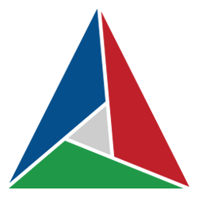

  <h1 align="center"><b>Hi there, I'm Paris</h1>

Software developer and undergrad student in software engineering.

----

  Let's Play Pokemon Red together! 
   

   Buttons:  
  <a href="http://emulatorserv.vps.webdock.io:8080/p?action=1&callback=http://github.com/OFFTKP/">Up</a>
   
  <a href="http://emulatorserv.vps.webdock.io:8080/p?action=4&callback=http://github.com/OFFTKP/">Left</a>
  <a href="http://emulatorserv.vps.webdock.io:8080/p?action=2&callback=http://github.com/OFFTKP/">Right</a>
   
  <a href="http://emulatorserv.vps.webdock.io:8080/p?action=3&callback=http://github.com/OFFTKP/">Down</a>  
  <a href="http://emulatorserv.vps.webdock.io:8080/p?action=5&callback=http://github.com/OFFTKP/">A</a>
  <a href="http://emulatorserv.vps.webdock.io:8080/p?action=6&callback=http://github.com/OFFTKP/">B</a> 
  <a href="http://emulatorserv.vps.webdock.io:8080/p?action=7&callback=http://github.com/OFFTKP/">Start</a>
    
  Made with <a href="https://github.com/OFFTKP/TKPEmu">TKPEmu</a>. 
   server started: 21/3/2022 
    
  

  

   
How was this done?

     
   First, let me make it clear that this is not my idea. Props to <a href="https://github.com/HFO4">HFO4</a>, check their profile page.  
   This was made possible with <a href="https://github.com/OFFTKP/TKPEmu">TKPEmu</a>.   
    
   TKPEmu is an open-source emulator and my favorite hobby project. It's a normal emulator with a GUI, disassembler etc. and one of its functionalities is playing games through a very simple web server.  
  Every button is a simple get request to a vps running TKPEmu. 
  You can customize it to create your own webserver! I will make a tutorial for this in the future.   
    
  Email me if you need help: parisoplop@gmail.com
  

---

   Currently working with: 
  
  
   Learning: 
  
  
  
  
  
   Have previously worked with: 
  
  

  <h2 align="center">Some of my projects</h2>
  
  
  
  

  <h2 align="center">About me :dart:</h2>

  Timezone: GMT+2

 

  When it comes to technology, I am interested in game development, chess engines, old games/consoles, game cheat creation, and automating daily tasks to make my life easier.

  I am also interested in chess, fish keeping, reading, drawing and gaming.

  If there's anything you need to ask me related to any of the above, send me an email: parisoplop@gmail.com

   
 

----

